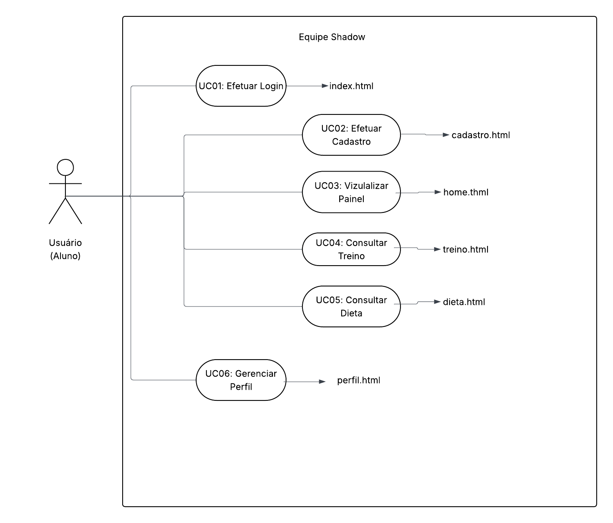

# FreakyZone — Equipe Shadow

Plataforma de consultoria fitness desenvolvida para a disciplina de **Programação para Web**.

---

## Sobre o Projeto

O FreakyZone é uma aplicação web completa integrada a uma API REST e banco de dados PostgreSQL. Permite que atletas gerenciem seus treinos, dieta e perfil de forma dinâmica.

---

## Tecnologias Utilizadas

**Front-end**
- HTML5, CSS3, JavaScript puro

**Back-end**
- Node.js + Express
- JWT (autenticação)
- bcryptjs (criptografia de senhas)

**Banco de Dados**
- PostgreSQL

**Ferramentas**
- Git & GitHub
- Figma (prototipação)
- pgAdmin (gerenciamento do banco)
- nodemon (desenvolvimento)

---

## Estrutura de Diretórios

```
Project_Gym_web/
├── index.html
├── assets/
│   └── css/
│       └── style.css
├── pages/
│   ├── cadastro.html
│   ├── home.html
│   ├── treino.html
│   ├── dieta.html
│   └── perfil.html
├── docs/
│   ├── diagrama_de_casos_de_uso.png
│   └── casos-de-uso-v2.md
├── .gitignore
├── README.md
└── server/
    ├── package.json
    ├── .env.example
    └── src/
        ├── app.js
        ├── config/
        │   ├── database.js
        │   └── schema.sql
        ├── controllers/
        │   ├── authController.js
        │   ├── treinoController.js
        │   ├── dietaController.js
        │   └── usuarioController.js
        ├── middlewares/
        │   └── authMiddleware.js
        └── routes/
            ├── authRoutes.js
            ├── treinoRoutes.js
            ├── dietaRoutes.js
            └── usuarioRoutes.js
```

---

## Pré-requisitos

Antes de rodar o projeto, instale na sua máquina:

- [Node.js LTS](https://nodejs.org) — versão 18 ou superior
- [PostgreSQL](https://www.postgresql.org/download/) — anote a senha definida na instalação

> **Atenção:** os comandos abaixo devem ser executados no **Command Prompt (CMD)** do Windows, não no PowerShell. No VS Code, clique na seta ao lado do `+` no terminal e escolha **Command Prompt**.

---

## Como Executar

### 1. Clone o repositório

```cmd
git clone https://github.com/SEU_USUARIO/Project_Gym_web.git
cd Project_Gym_web
```

### 2. Configure o banco de dados

Abra o **pgAdmin**, crie um banco chamado `ironzone`, abra o **Query Tool** e execute o conteúdo do arquivo `server/src/config/schema.sql`.

### 3. Configure as variáveis de ambiente

Dentro da pasta `server/`, crie um arquivo `.env` baseado no `.env.example`:

```cmd
cd server
copy .env.example .env
```

Abra o `.env` e preencha com suas credenciais:

```
DB_HOST=localhost
DB_PORT=5432
DB_NAME=ironzone
DB_USER=postgres
DB_PASSWORD=sua_senha_aqui
JWT_SECRET=segredo123
PORT=3333
```

### 4. Instale as dependências

```cmd
npm install
```

### 5. Inicie o servidor

```cmd
npm run dev
```

Se aparecer no terminal:

```
Servidor rodando na porta 3333
PostgreSQL conectado!
```

O projeto está funcionando. Acesse no navegador:

```
http://localhost:3333
```

---

## Endpoints da API

| Método | Endpoint | Descrição | Auth |
|--------|----------|-----------|------|
| POST | `/api/auth/cadastro` | Cadastrar usuário | Não |
| POST | `/api/auth/login` | Fazer login | Não |
| GET | `/api/treinos` | Listar treinos | Sim |
| POST | `/api/treinos` | Cadastrar treino | Sim |
| GET | `/api/dietas` | Listar refeições | Sim |
| POST | `/api/dietas` | Adicionar refeição | Sim |
| GET | `/api/usuarios/perfil` | Ver perfil | Sim |
| PUT | `/api/usuarios/perfil` | Atualizar perfil | Sim |

> Rotas com **Auth: Sim** exigem o header `Authorization: Bearer <token>`.

---

## Banco de Dados

Tabelas criadas no PostgreSQL:

| Tabela | Descrição |
|--------|-----------|
| `usuarios` | Dados dos usuários cadastrados |
| `treinos` | Treinos vinculados a um usuário |
| `exercicios` | Exercícios vinculados a um treino |
| `dietas` | Refeições vinculadas a um usuário |

---

## Casos de Uso

| UC | Nome | Entrega |
|----|------|---------|
| UC01 | Efetuar Login | 01 |
| UC02 | Efetuar Cadastro | 01 |
| UC03 | Visualizar Painel | 01 |
| UC04 | Consultar Treino | 01 |
| UC05 | Consultar Dieta | 01 |
| UC06 | Gerenciar Perfil | 01 |
| UC07 | Cadastrar Treino | 02 |
| UC08 | Adicionar Refeição | 02 |
| UC09 | Atualizar Perfil | 02 |
| UC10 | Listar Treinos via API | 02 |

---


## 🎨 Design do Projeto
Você pode visualizar o protótipo interativo no Figma através do link abaixo:
* [Protótipo no Figma](https://www.figma.com/design/elYdlws8eHOEnBasBrfRBw/Figma-basics?node-id=1847-2&t=piWF2I648WdjimWg-1)

## 📊 Diagrama de Casos de Uso
Abaixo está a representação visual das funcionalidades do sistema:



## 👨‍💻 Autor

Desenvolvido por **Fernandes**
