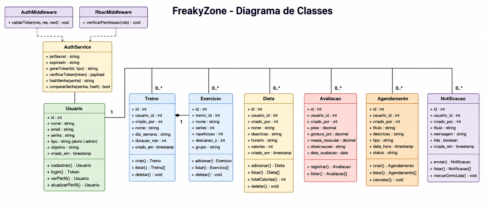

# FreakyZone — Project GYM Web

Sistema web para gerenciamento de academia, desenvolvido para a disciplina de **Programação para Web**.

A aplicação permite que administradores/professores gerenciem alunos, treinos, dietas, avaliações físicas, agendamentos e notificações. Os alunos conseguem acessar uma área própria para visualizar seus treinos, refeições, agenda, notificações e dados de perfil.

---

## Deploy

### Front-end

https://project-gym-web-orcin.vercel.app

### Back-end / API

https://freakyzone-api.onrender.com

---

## Tecnologias utilizadas

### Front-end

* Next.js
* React
* TypeScript
* Tailwind CSS
* App Router
* LocalStorage para armazenamento do token JWT

### Back-end

* Node.js
* Express.js
* PostgreSQL
* JWT para autenticação
* RBAC para controle de acesso por perfil
* Bcrypt para criptografia de senha
* CORS
* dotenv

### Banco de Dados

* PostgreSQL local
* PostgreSQL em produção no Render

### Deploy

* Vercel para o front-end
* Render para o back-end
* Render PostgreSQL para o banco de dados

---

## Funcionalidades implementadas

### Autenticação

* Cadastro de aluno
* Login de usuário
* Proteção de rotas por token JWT
* Controle de acesso por perfil de usuário

### Área do Administrador / Professor

O painel administrativo permite:

* Listar alunos cadastrados
* Criar treinos para alunos
* Criar dietas/refeições para alunos
* Registrar avaliações físicas
* Criar agendamentos
* Enviar notificações
* Realizar logout

### Área do Aluno

O aluno consegue:

* Acessar a home com resumo geral
* Visualizar seus treinos
* Visualizar suas dietas/refeições
* Visualizar sua agenda
* Visualizar suas notificações
* Visualizar seus dados de perfil
* Realizar logout

---

## Estrutura do projeto

```txt
Project_Gym_web/
├── frontend-next/
│   ├── app/
│   │   ├── admin/
│   │   ├── agenda/
│   │   ├── cadastro/
│   │   ├── dietas/
│   │   ├── home/
│   │   ├── login/
│   │   ├── notificacoes/
│   │   ├── perfil/
│   │   └── treinos/
│   │
│   ├── components/
│   │   ├── admin/
│   │   └── aluno/
│   │
│   ├── services/
│   └── package.json
│
├── server/
│   ├── src/
│   │   ├── config/
│   │   ├── controllers/
│   │   ├── middlewares/
│   │   ├── models/
│   │   ├── repositories/
│   │   ├── routes/
│   │   ├── services/
│   │   └── app.js
│   │
│   └── package.json
│
└── README.md
```

---

## Como executar o projeto localmente

Para rodar o projeto localmente, é necessário ter instalado:

* Node.js
* npm
* PostgreSQL
* Git

---

## Configuração do banco de dados local

Crie um banco PostgreSQL chamado:

```sql
freakyzone
```

Depois execute o arquivo de schema:

```powershell
& "C:\Program Files\PostgreSQL\18\bin\psql.exe" -U postgres -d freakyzone -f "server\src\config\schema.sql"
```

Caso precise corrigir a senha do administrador local, execute:

```sql
UPDATE usuarios
SET senha = '$2a$10$msNK6I31Ap9b3y/q41fNtuote46cTw0heHIDQLZqL/sDajVZFpaga'
WHERE email = 'admin@freakyzone.com';
```

A senha do administrador ficará:

```txt
admin123
```

---

## Configuração do back-end

Entre na pasta do servidor:

```powershell
cd server
```

Instale as dependências:

```powershell
npm install
```

Crie um arquivo `.env` dentro da pasta `server` com o seguinte conteúdo:

```env
DB_HOST=localhost
DB_PORT=5432
DB_NAME=freakyzone
DB_USER=postgres
DB_PASSWORD=sua_senha_do_postgres
JWT_SECRET=sua_chave_secreta
JWT_EXPIRES_IN=7d
PORT=3333
NODE_ENV=development
```

Execute o servidor:

```powershell
npm run dev
```

Ou:

```powershell
npm start
```

O back-end local ficará disponível em:

```txt
http://localhost:3333
```

A API local ficará disponível em:

```txt
http://localhost:3333/api
```

---

## Configuração do front-end

Entre na pasta do front-end:

```powershell
cd frontend-next
```

Instale as dependências:

```powershell
npm install
```

Crie um arquivo `.env.local` dentro da pasta `frontend-next`:

```env
NEXT_PUBLIC_API_URL=http://localhost:3333/api
```

Execute o front-end:

```powershell
npm run dev
```

O front-end local ficará disponível em:

```txt
http://localhost:3000
```

---

## Variáveis de ambiente em produção

### Front-end na Vercel

Na Vercel, foi configurada a variável:

```env
NEXT_PUBLIC_API_URL=https://freakyzone-api.onrender.com/api
```

### Back-end no Render

No Render, o back-end usa variáveis de ambiente semelhantes a:

```env
DB_HOST=host_do_banco_render
DB_PORT=5432
DB_NAME=freakyzone
DB_USER=usuario_do_banco
DB_PASSWORD=senha_do_banco
JWT_SECRET=sua_chave_secreta
JWT_EXPIRES_IN=7d
NODE_ENV=production
```

O arquivo `.env` não deve ser enviado para o GitHub.

---

## Usuário administrador de teste

```txt
E-mail: admin@freakyzone.com
Senha: admin123
Perfil: admin
```

---

## Principais rotas do front-end

```txt
/               Redireciona para /login
/login          Tela de login
/cadastro       Tela de cadastro de aluno
/admin          Painel administrativo
/home           Home do aluno
/treinos        Treinos do aluno
/dietas         Dietas do aluno
/agenda         Agenda do aluno
/notificacoes   Notificações do aluno
/perfil         Perfil do aluno
```

---

## Principais endpoints da API

### Autenticação

```txt
POST /api/auth/cadastro
POST /api/auth/login
```

### Usuários

```txt
GET /api/usuarios/perfil
PUT /api/usuarios/perfil
GET /api/usuarios/alunos
```

### Treinos

```txt
GET /api/treinos
POST /api/treinos
```

### Dietas

```txt
GET /api/dietas
POST /api/dietas
```

### Avaliações

```txt
GET /api/avaliacoes
POST /api/avaliacoes
```

### Agendamentos

```txt
GET /api/agendamentos
POST /api/agendamentos
```

### Notificações

```txt
GET /api/notificacoes
POST /api/notificacoes
```

---

## Banco de dados

O banco de dados possui as seguintes tabelas principais:

```txt
usuarios
treinos
exercicios
dietas
avaliacoes
agendamentos
notificacoes
```

Essas tabelas armazenam os dados dos usuários, treinos, exercícios, refeições, avaliações físicas, agenda e notificações.

---

## Autenticação e autorização

O sistema utiliza autenticação com JWT.

Após o login, a API retorna um token, que é armazenado no front-end e enviado nas próximas requisições protegidas.

Também foi implementado controle de acesso por perfil de usuário, utilizando RBAC.

Perfis principais:

```txt
admin
aluno
```

O perfil `admin` pode acessar o painel administrativo e gerenciar alunos, treinos, dietas, avaliações, agendamentos e notificações.

O perfil `aluno` acessa somente sua área pessoal.

---

## Como testar o build do front-end

Dentro da pasta `frontend-next`, execute:

```powershell
npm run build
```

O build deve finalizar sem erros.

---

## Como testar o back-end

Dentro da pasta `server`, execute:

```powershell
npm start
```

Depois teste o login com:

```powershell
Invoke-RestMethod -Method Post -Uri "http://localhost:3333/api/auth/login" -ContentType "application/json" -Body '{"email":"admin@freakyzone.com","senha":"admin123"}'
```

---

## Status atual do projeto

* Front-end em Next.js funcionando
* Back-end em Node.js/Express funcionando
* Banco PostgreSQL integrado
* Deploy do front-end realizado na Vercel
* Deploy do back-end realizado no Render
* API conectada ao banco PostgreSQL online
* Cadastro, login, painel admin e área do aluno funcionando
* Build do front-end finalizado com sucesso

---

## Observações importantes

O serviço gratuito do Render pode demorar alguns segundos no primeiro acesso após ficar inativo. Isso ocorre porque o serviço pode entrar em modo de repouso quando não recebe requisições por algum tempo.

Antes da apresentação, é recomendado abrir o sistema e realizar um login para garantir que o back-end já esteja ativo.

---

## Segurança

O arquivo `.env` não deve ser enviado para o GitHub.

As senhas e dados reais do banco devem ficar configurados somente nos ambientes locais e nas plataformas de deploy.

---

## Projeto acadêmico

Este projeto foi desenvolvido como parte da avaliação da disciplina de Programação para Web.

A aplicação atende aos requisitos de front-end, back-end, banco de dados relacional, integração com API REST, autenticação, controle de acesso e deploy público.


## 🎨 Design do Projeto
Você pode visualizar o protótipo interativo no Figma através do link abaixo:
* [Protótipo no Figma](https://www.figma.com/design/elYdlws8eHOEnBasBrfRBw/Figma-basics?node-id=1847-2&t=piWF2I648WdjimWg-1)

## 📊 Diagrama de Casos de Uso
Abaixo está a representação visual das funcionalidades do sistema:


## 📊 Diagrama de Classes
Abaixo está a representação visual das funcionalidades que represente o domínio da
aplicação back-end:



## 👨‍💻 Autor

Desenvolvido por **Fernandes**
